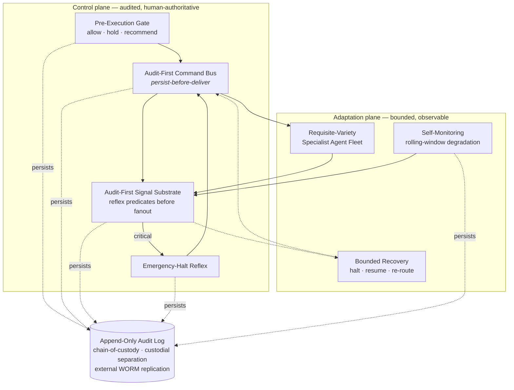
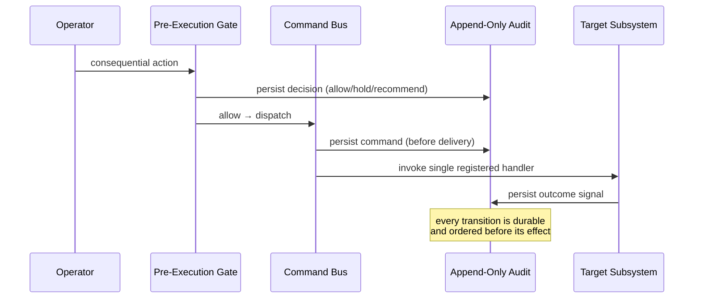

# MILO — Reference Architecture Overview

This document is a companion to [PRINCIPLES.md](PRINCIPLES.md) and the five
[architectural papers](articles/README.md). Where the papers establish *why* the
architecture is shaped the way it is — grounded in physical law, cybernetics, control
theory, and resilience engineering — this overview describes *how the subsystems are
decomposed* so that those principles hold as structural properties rather than as runtime
policy.

It is written at the **architectural-principle level**. It names responsibilities and
mechanisms, not implementations: no source, no vendor or product names, no API surface.
Consistent with the repository's posture — *architectural reference public; all
source-code rights reserved; patent pending* (USPTO Serial No. 99706004).

> *MILO does not predict the future. It remains viable in any future.*

---

## 1. Two planes: control and adaptation

MILO separates two concerns that are frequently conflated in agentic systems: the
**control plane** that moves consequential actions through an auditable, human-authoritative
path, and the **adaptation plane** that lets the system observe itself, route work to
specialist capacity, and recover within explicit bounds. Neither plane can silently
bypass the other; both persist before they act.

The four control-plane mechanisms are the ones demonstrated in the runnable reference
in [`examples/persist_before_deliver.py`](examples/persist_before_deliver.py)
(~150 lines, standard library only).

---

## 2. Subsystem decomposition — a software-engineering view

The architecture is organized as a set of **discrete single-responsibility subsystems**
(Principle 4; Principle 1's modularity constraint). The table below names each
responsibility using the vocabulary a working software engineer already has — composition
roots, message buses, gateways, worker pools, supervisors — so the public structure is
legible without reference to any internal organizing method. Each row names one
architectural responsibility and the principle it serves.

| Subsystem | Software-engineering analog | Architectural responsibility | Primary principle served |
|---|---|---|---|
| **Composition root** | DI container / wiring layer | Constructs and owns the lifecycle of every subsystem; nothing self-wires | P4 single-target dispatch; P1 modularity |
| **Command & signal bus** | Message bus + event bus | The audited command bus plus the reflex-predicate signal carrier | P3 variance reduction at the carrier; P4 explicit dispatch |
| **Inference gateway** | Provider router with failover | Uniform interface over interchangeable reasoning backends; health-aware failover | P2 requisite variety; P6 tail tolerance |
| **Intake & dispatcher** | Work queue + worker pool intake | Accepts work and dispatches it to specialist capacity | P2 requisite variety |
| **Policy layer** | Feature flags · rate limiter · circuit breakers | Slow-acting regulation and safeguards that bound behavior | P5 bounded response |
| **Health supervisor** | Health checks + self-healing supervisor | Degradation sensing, error detection, and self-heal initiation | P6 tail-event preparedness |
| **Request router** | Router / task decomposer | Decomposes requests and assigns each to the correct handler | P4 explicit dispatch |
| **Executors** | Workers / job handlers | Carry out a dispatched action against the world | P4 single target |
| **Input adapters** | Receptors / parsers / deserializers | Normalize external input into typed signals | P3 carrier-level normalization |
| **Persistence layer** | Repositories + coordination ledger + accounting | Durable state, coordination ledger, and resource/budget accounting; decides what is kept | P5 bounded state; P6 bounded reporting |
| **API boundary** | API gateway + route table | The network surface and route table separating inside from outside | P4 explicit surface; least privilege |

Each subsystem observes only typed signals and receives only explicitly dispatched
commands — the same discipline a well-structured codebase enforces with interfaces and an
event bus instead of cross-module reach-through. The failure mode this decomposition
prevents is the monolith in which a single drifted component forces a whole-system
redeploy (Principle 1).

---

## 3. Cross-cutting mechanisms

### 3.1 Persist-before-deliver
Every visible state is backed by a persisted event written **before** the corresponding
action is delivered. Audit precedes effect. A crash between persist and deliver is
recoverable because the intent is already on durable storage; a delivery that was never
persisted cannot exist. This is the substrate property explored in
[Article 4](articles/04-Eight-Structural-Principles.md) and demonstrated in the example.

### 3.2 Single-target dispatch
Each command names exactly one explicit target. The bus persists the command, resolves the
single registered handler, and invokes it. There is no implicit resolver and no opaque
fan-out on the command path. A failure is always traceable to a specific dispatch
(Principle 4).

### 3.3 Reflex predicates and the emergency halt
Critical signals are evaluated by reflex predicates **before** ordinary subscribers see
them, so a safety-critical condition can short-circuit to an emergency-halt command without
waiting on the normal fan-out. The halt travels the same audited command path as any other
command — there is no privileged side channel (Principle 5).

### 3.4 Bounded recovery
Every adaptive subsystem admits an explicit **halt-and-resume** pathway. Recovery is a
first-class, bounded operation: re-route to healthy capacity, resume from the last persisted
state, or hold for the operator — never an unbounded retry loop. Adaptation that drifts
without a stop condition is treated as failure, not learning (Principle 5).

### 3.5 Power-law self-monitoring
The system monitors itself on a bounded cadence using rolling-window degradation detection
rather than threshold-only alarms, and it bounds its own reporting so that a tail event does
not produce an alert storm. The design target is the 99th-percentile event, not the median
(Principle 6).

### 3.6 Requisite-variety agent fleet
Domain variety is met by a fleet of specialist agents whose combined repertoire matches the
domain, rather than by a single generalist. Routing to a specialist is an explicit dispatch;
the fleet's variety is an architectural quantity, not an emergent hope (Principle 2).

### 3.7 Provider-agnostic inference routing
Reasoning capacity is reached through a **uniform routing interface** over interchangeable
backends. No subsystem is coupled to a particular reasoning provider; the router selects and
fails over among backends on health and consequence grounds. This is the requisite-variety
principle applied to inference supply, and it is what lets the system remain viable when any
single supply path degrades (Principles 2 and 6). External operational services are reached
through the same least-privilege adapter discipline.

### 3.8 Edge-served behavior configuration
Behavior parameters that must change faster than a client-release cycle are served from a
configuration plane at the edge and fetched by deployed clients, so operator-tunable behavior
can change **without** re-releasing a client. The configuration plane is itself gated and
audited; it tunes parameters within pre-approved bounds and cannot grant a client a new
consequential capability. This keeps Principle 5's bounded-response guarantee intact across
the release boundary.

### 3.9 Multi-agent coordination via an append-only ledger
When multiple autonomous agents operate against shared state, they coordinate through an
**append-only coordination ledger**: each agent claims what it will touch, appends its
intent and outcome, and never overwrites another's record. Human-readable status views are
*rendered from* the ledger, never authored in parallel with it — there is one source of
truth and the rest are projections. This is the same persist-before-deliver discipline
applied to coordination, and it is what prevents two agents from silently diverging on one
shared surface.

### 3.10 Durable, contention-resilient state
Persistence is designed to survive contention and transient I/O faults: appends are retried
under bounded backoff, writers degrade gracefully rather than crash a caller, and durable
storage is kept off failure-prone synchronization paths. Bounded recovery (3.4) applies to
the state layer itself.

---

## 4. How a consequential action flows

1. The action reaches the **Pre-Execution Gate**, which records an `allow / hold /
   recommend` decision. Human authority is the default for consequential actions
   (Supervisory Primacy — [Article 3](articles/03-Supervisory-Primacy.md)).
2. On `allow`, the **Command Bus** persists the command before delivering it and invokes
   the single registered handler (3.1, 3.2).
3. The handling subsystem executes and emits typed **signals**.
4. The **Signal Substrate** evaluates reflex predicates first; a critical condition can
   trigger the **Emergency-Halt Reflex** down the same audited command path (3.3).
5. **Self-monitoring** observes outcomes over rolling windows; degradation initiates
   **bounded recovery** rather than an unbounded retry (3.4, 3.5).
6. Every transition above is persisted before its effect, producing a complete, ordered
   audit trail with chain-of-custody and external replication.

---

## 5. Regulatory and oversight alignment

The decomposition is designed so that the eight **operational integrity constraints**
([PRINCIPLES.md](PRINCIPLES.md)) are enforceable as build-level invariants rather than
toggleable runtime policy: operator authority as the invariant, individual-baseline-only
measurement, no surveillance architecture, override always available and always logged,
plain-language explanation on every recommendation, and data sovereignty for any
operator-layer data. The posture is consistent with **EU AI Act Article 14** human
oversight, **NIST AI RMF 1.0** (Appendix C, Human-AI Interaction), **NIST SP 800-82r3**
for operational-technology security, and **ISA/IEC 62443** for industrial cybersecurity.
Where operator-layer measurement is involved, the architecture persists no biometric
template and compares only against the individual's own baseline (Principles 7–8), in line
with data-minimization expectations under GDPR and CCPA-class regimes.

---

## 6. Scope and status

This overview describes the **reference architecture** and its design-time constraints. As
noted in [PRINCIPLES.md](PRINCIPLES.md), the operator-cognitive frameworks (Principles 7
and 8) are design-stage; nothing here should be read as a claim about a shipped
operator-monitoring product. The runnable artifact in
[`examples/persist_before_deliver.py`](examples/persist_before_deliver.py) is the only
executable reference in this repository and implements four control-plane mechanisms; the
remaining subsystems are described at the architectural level.

For the full reasoning behind each mechanism, see the five
[architectural papers](articles/README.md) and their minted DOIs.

---

© 2026 Jorge Enrique Flores Montano · JM Automated Solutions
~MILO™ is a trademark of Jorge Enrique Flores Montano · USPTO Serial No. 99706004 · Patent Pending.
