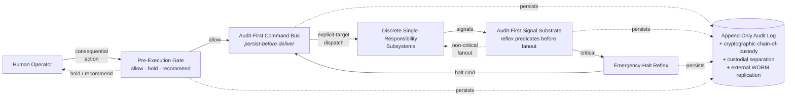

# ~MILO™ — Modular Intelligent Learning Orchestrator

[](https://doi.org/10.5281/zenodo.20117025)
[](https://creativecommons.org/licenses/by/4.0/)
[](https://github.com/jmontano1/milo-architecture/actions/workflows/ci.yml)

> *MILO does not predict the future. It remains viable in any future.*

**Adaptive AI orchestration for high-consequence critical-infrastructure environments.**

| | |
|---|---|
| **DOI** | [`10.5281/zenodo.20117025`](https://doi.org/10.5281/zenodo.20117025) (concept DOI; persistent across versions) |
| **Trademark** | ~MILO™ — USPTO Serial No. **99706004** (filed March 16, 2026; intent-to-use, Class 009) |
| **Patent** | **Patent Pending** |
| **Federal engagement** | Materials transmitted to the U.S. Department of Energy **Genesis Mission** (EO 14363, Nov 2025) under identifiers **MILO-ES-2026-002** and **MILO-ES-2026-003-DOE** — **transmission only**; no endorsement, selection, funding, or award is claimed |
| **Inventor** | Jorge Enrique Flores Montano · Founder, JM Automated Solutions · [ORCID 0009-0003-1859-8418](https://orcid.org/0009-0003-1859-8418) |
| **License (docs)** | [CC BY 4.0](LICENSE) · *All source-code rights reserved; patent pending* |
| **Contact** | jmontano@jmautomated.com |
| **Verify claims** | [VERIFY.md](VERIFY.md) · [CLAIMS.md](CLAIMS.md) · [STANDARDS_CROSSWALK.md](STANDARDS_CROSSWALK.md) · [MECHANISM_MAP.md](MECHANISM_MAP.md) |
| **Independent reviewers** | **Start here → [FOR_INDEPENDENT_REVIEWERS.md](FOR_INDEPENDENT_REVIEWERS.md)** |

### Arrived from a paper or exhibit that cites this repository?

This GitHub URL is the public architectural reference printed alongside the MILO article series
and related materials. Open **[FOR_INDEPENDENT_REVIEWERS.md](FOR_INDEPENDENT_REVIEWERS.md)** first
(60-second path: VERIFY → CLAIMS → demos → articles/DOIs). No login required.

**Quick self-check (no network, no secrets):**

```bash
python3 examples/test_reference.py
```

---

## Read MILO in 60 seconds

**In plain terms:** MILO is an architecture for AI in places where failure is catastrophic — power grids, nuclear facilities, manufacturing lines — built to stay **auditable and human-controllable even in conditions it was never trained for.** Where mainstream AI optimizes for prediction accuracy, MILO optimizes for *viability*.

- **The idea** → the [eight structural principles](#eight-structural-principles): six established physical, control-theoretic, and statistical laws applied as design constraints, plus two original operator-layer frameworks.
- **As software** → [`ARCHITECTURE.md`](ARCHITECTURE.md) — the engineer-facing decomposition (composition root · message bus · gateway · worker pool · supervisor).
- **What actually runs** → [`examples/persist_before_deliver.py`](examples/persist_before_deliver.py), a ~150-line standard-library reference. Run it in 60 seconds: [`QUICKSTART.md`](QUICKSTART.md).
- **Real vs. design-stage, and what's original** → the [`EVALUATION.md`](EVALUATION.md) reviewer's guide.

| Layer | State | Evidence |
|---|---|---|
| Audit-first command flow · pre-execution gate · single-target dispatch · reflex halt | ✅ **runnable reference** | [`examples/persist_before_deliver.py`](examples/persist_before_deliver.py) |
| Inference gateway · agent fleet · health supervisor · coordination ledger · adaptation plane | 🔶 **design-stage** | [`ARCHITECTURE.md`](ARCHITECTURE.md) §2–§3 |
| Operator-cognitive layer (Principles 7–8) | 🔶 design-stage · **original** | [`PRINCIPLES.md`](PRINCIPLES.md) · [Article 4](articles/04-Eight-Structural-Principles.md) |

---

## What MILO is

MILO is a **patent-pending adaptive AI orchestration architecture** designed for environments where the cost of failure is severe: energy grid control rooms, nuclear facilities, advanced manufacturing lines, autonomous robotics under human supervision, satellite and space operations, and human-in-the-loop AI for high-consequence decision support.

The dominant paradigm in AI today optimizes for **prediction accuracy** against an expected future distribution. MILO is designed for **viability** — the capacity to remain operational, auditable, and human-controllable under operational futures the system was not trained to expect. The architectural mechanisms that produce viability — audit-first command flow, modular subsystems with strict separation of concerns, bounded recovery pathways, tail-event preparation, reviewed-outcome learning, and preserved operator authority — together produce a system that does not require accurate prediction to remain useful.

MILO is grounded in established standards (NIST SP 800-82r3 for operational-technology security, NIST SP 800-90B for cryptographic entropy, ISA/IEC 62443 for industrial cybersecurity, EU AI Act Article 14 for human oversight, NIST AI RMF 1.0 for AI risk management) and in the cybernetics, control theory, information theory, and resilience-engineering lineages of Beer, Ashby, Shannon, Lyapunov, Hollnagel, Taleb, and Clauset.

---

## Architecture at a glance



Every visible state in the architecture is backed by a persisted event. Audit precedes delivery; explicit-target dispatch precludes implicit routing; reflex predicates short-circuit critical signals before subscribers see them; operator override is always available and always logged. A minimal runnable reference implementing four of these mechanisms in ~150 lines of standard-library Python is provided in [`examples/persist_before_deliver.py`](examples/persist_before_deliver.py).

For a fuller, engineer-facing walkthrough of how the subsystems are decomposed — described in plain software-engineering terms (composition root, message bus, gateway, worker pool, supervisor) — see [**ARCHITECTURE.md**](ARCHITECTURE.md).

---

## Architectural papers

Five standalone papers articulate MILO's architecture, each grounded in established external sources and verifiable against public standards. Two PDF formats are provided for every paper:

- **Standard PDF** (`pdfs/`) — rendered from markdown via ReportLab. Primary citation-anchor version with inline architectural figures, hyperlinked references, and PDF bookmarks.
- **Scholarly LaTeX PDF** (`pdfs-singlecol/`) — single-column scholarly typesetting via pandoc + tectonic with the LaTeX `article` class. The full LaTeX source bundle (with figures) is in [`latex-sources/`](latex-sources/) so any peer-reviewed journal editor can re-typeset the manuscript directly into their template.

| # | Title | DOI | Standard | LaTeX | Domain |
|---|---|---|:---:|:---:|---|
| 1 | [Independence as an Architectural Property: A Research Direction for Multi-Source Cryptographic Entropy](articles/01-Independence-as-Architectural-Property.md) | [10.5281/zenodo.20117647](https://doi.org/10.5281/zenodo.20117647) | [📄](pdfs/MILO_Article_01_ThermalEntropy.pdf) | [📑](pdfs-singlecol/MILO_Article_01_ThermalEntropy_singlecol.pdf) | Cryptographic entropy · TRNG · NIST SP 800-90B |
| 2 | [Latency-Aware Authentication in Industrial Control Environments](articles/02-Latency-Aware-Authentication.md) | [10.5281/zenodo.20117651](https://doi.org/10.5281/zenodo.20117651) | [📄](pdfs/MILO_Article_02_LatencyAuth.pdf) | [📑](pdfs-singlecol/MILO_Article_02_LatencyAuth_singlecol.pdf) | OT cybersecurity · ISA/IEC 62443 · NIST SP 800-82r3 |
| 3 | [Supervisory Primacy: Human-in-the-Loop AI Orchestration for High-Consequence Domains](articles/03-Supervisory-Primacy.md) | [10.5281/zenodo.20117662](https://doi.org/10.5281/zenodo.20117662) | [📄](pdfs/MILO_Article_03_SupervisoryPrimacy.pdf) | [📑](pdfs-singlecol/MILO_Article_03_SupervisoryPrimacy_singlecol.pdf) | AI governance · HITL · EU AI Act Article 14 |
| 4 | [Eight Structural Principles for Adaptive AI Architecture](articles/04-Eight-Structural-Principles.md) | [10.5281/zenodo.20117703](https://doi.org/10.5281/zenodo.20117703) | [📄](pdfs/MILO_Article_04_GoverningPrinciples.pdf) | [📑](pdfs-singlecol/MILO_Article_04_GoverningPrinciples_singlecol.pdf) | Adaptive AI theory · Cybernetics · Control theory |
| 5 | [Adaptive Resilience: Why AI Systems Must Remain Viable in Any Future](articles/05-Adaptive-Resilience.md) | [10.5281/zenodo.20117716](https://doi.org/10.5281/zenodo.20117716) | [📄](pdfs/MILO_Article_05_AdaptiveResilience.pdf) | [📑](pdfs-singlecol/MILO_Article_05_AdaptiveResilience_singlecol.pdf) | AI resilience · Viability · Non-stationary environments |

**Concept DOI** (whole architectural reference, persistent across versions): [10.5281/zenodo.20117025](https://doi.org/10.5281/zenodo.20117025)

See [`articles/README.md`](articles/README.md) for full abstracts of each paper.

---

## Eight structural principles

The MILO architecture is governed by eight design-time constraints. Six are established physical, informational, control-theoretic, and statistical laws applied as architectural design constraints. Two are original frameworks proposed by the author for the operator-cognitive performance layer of high-consequence systems.

1. **Second Law of Thermodynamics** — entropy treated as an architectural diagnostic signal, not a fault to be suppressed.
2. **Ashby's Law of Requisite Variety** — a regulator must possess variety at least equal to the system it regulates; implemented as a fleet of specialist agents, not a single generalist.
3. **Shannon Information Theory** — variance reduction occurs at the signal-carrier level, not redundantly at each consumer.
4. **Principle of Least Action — Single-Target Dispatch** — every command has exactly one explicit target; no implicit resolvers, no opaque dispatchers.
5. **Lyapunov-Style Bounded Response** — every adaptive subsystem admits an explicit halt-and-resume pathway; adaptation that drifts unboundedly is failure, not learning.
6. **Power-Law Distribution Architecture** — engineered for the 99th-percentile event, not the median.
7. **Individual-Baseline Variance Modeling** *(original)* — operator-layer interventions calibrated against the individual's own established performance baseline, never a population norm.
8. **Precision Perturbation Without Variance Compression** *(original)* — operator-layer interventions shift probability mass toward high-reliability decision outputs while preserving operator authority and the variability that *is* the operator's adaptive intelligence.

See [PRINCIPLES.md](PRINCIPLES.md) for fuller treatments, and [Article 4](articles/04-Eight-Structural-Principles.md) for the full synthesis.

---

## Eight operational integrity constraints

Architectural commitments designed to be implemented as **enforceable code-level invariants** in deployment builds — not as runtime policy or configuration that can be toggled off under operational pressure.

1. **No coercion, ever** — the system issues recommendations, never compels.
2. **Individual baseline only** — measurements compared against the operator's own baseline, never against a population norm, government standard, or productivity target.
3. **No surveillance architecture** — designed as a performance-support tool, not a monitoring infrastructure.
4. **Operator authority is the invariant** — the system expands effective decision options; it never narrows or preempts them.
5. **Operational transparency** — every recommendation includes a plain-language explanation.
6. **Data sovereignty** — operator-layer data belongs to the institutional program under documented data governance.
7. **Override always available** — operators can override any recommendation at any time, with overrides logged for audit but never used for adverse personnel action.
8. **Independent oversight** — operator-layer deployments require institutional ethics-board review, published consent frameworks, and periodic third-party audits.

---

## U.S. national-interest context

The architectural commitments of MILO are framed against the deployment context identified by the **U.S. Department of Energy Genesis Mission** (Executive Order 14363, November 2025) for AI-enabled critical-infrastructure systems: advanced manufacturing, grid reliability, autonomous systems, nuclear-facility operations, and human-in-the-loop AI for high-consequence decision support. The architecture is consistent with the U.S. **NIST AI Risk Management Framework 1.0** (Appendix C on Human-AI Interaction), with **CISA Critical Manufacturing Sector** cybersecurity priorities, and with the **EU AI Act Article 14** human-oversight requirements for cross-border interoperability.

---

## Author

**Jorge Enrique Flores Montano** is the founder of JM Automated Solutions and the inventor of MILO. He holds an M.S. in Industrial Engineering (December 2018, with a minor in Applied Statistics and a certification in Public Utilities Regulation Economics) and a B.S. in Mechatronics Engineering (May 2016, with a minor in Industrial Automation). He is a CONACYT-SENER federal scholar and a member of Alpha Pi Mu, the U.S. industrial-engineering honor society. He has over seven years of hands-on deployment experience in industrial vision and automation systems across the food, beverage, pharmaceutical, and medical-device manufacturing domains. His work in adaptive AI architecture focuses on cryptographic entropy sourcing, industrial control authentication, supervisory primacy for human-in-the-loop AI, and the structural principles of viable adaptive AI orchestration.

---

## License and citation

The architectural manuscripts in this repository are released under the **Creative Commons Attribution 4.0 International License** ([CC BY 4.0](LICENSE)) for academic and public use, with attribution to Jorge Enrique Flores Montano and reference to USPTO Serial No. 99706004.

**All source-code rights for the underlying MILO implementation are reserved. Patent pending.**

### How to cite

```bibtex
@misc{flores_montano_milo_2026,
  author       = {Flores Montano, Jorge Enrique},
  title        = {{MILO} --- {M}odular {I}ntelligent {L}earning {O}rchestrator:
                  A Public Architectural Reference},
  year         = {2026},
  publisher    = {Zenodo},
  doi          = {10.5281/zenodo.20117025},
  url          = {https://doi.org/10.5281/zenodo.20117025},
  note         = {Patent pending; USPTO Serial No.~99706004. CC BY 4.0.}
}
```

Or use the structured `CITATION.cff` for automatic citation export — GitHub renders a "Cite this repository" widget at the top-right of the repo page.

---

## A note on the mark form

The mark filed at USPTO is `~MILO` with a leading tilde. The tilde is part of the registered mark form, included to distinguish the application from senior MILO marks held by unrelated owners in different International Classes (e.g., Nestlé's MILO in Class 30 for chocolate beverages, dating to the 1930s). The author's application is in **International Class 009** (downloadable AI software). The acronym "MILO" remains the spoken/written name of the system and is used in body text throughout the manuscripts; `~MILO™` is the brand-mark form used in trademark notices and on the title page of each paper.

---

## Status

- ✅ ~MILO™ trademark filed (USPTO Serial No. 99706004 — March 16, 2026)
- ✅ Five architectural manuscripts complete (this repository)
- ✅ Federal submission under DOE Genesis Mission
- ⏳ Patent application pending
- ⏳ arXiv preprint deposition in preparation
- ⏳ Peer-reviewed journal submissions in preparation

---

© 2026 Jorge Enrique Flores Montano · JM Automated Solutions  
~MILO™ is a trademark of Jorge Enrique Flores Montano · USPTO Serial No. 99706004 · Patent Pending.
